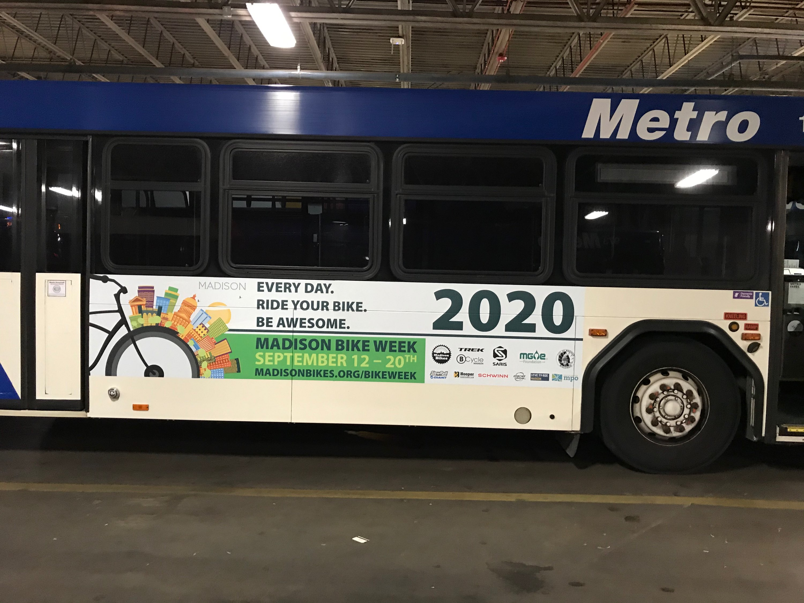

# bus_tracker: Tracking the Madison Bike Week bus
This is a Shiny app that shows the position of selected buses by vehicle ID. For example, [Madison Bikes](http://www.madisonbikes.org) runs advertisements for Madison Bike Week on some buses, or you can track the new battery-electric buses. The app is available at https://haraldkliems.shinyapps.io/bus_tracker/

# Functionality
Creates a `leaflet` map that shows the bus position, with a button to manually refresh the position. A popup message provides information about which route the bus is on.
